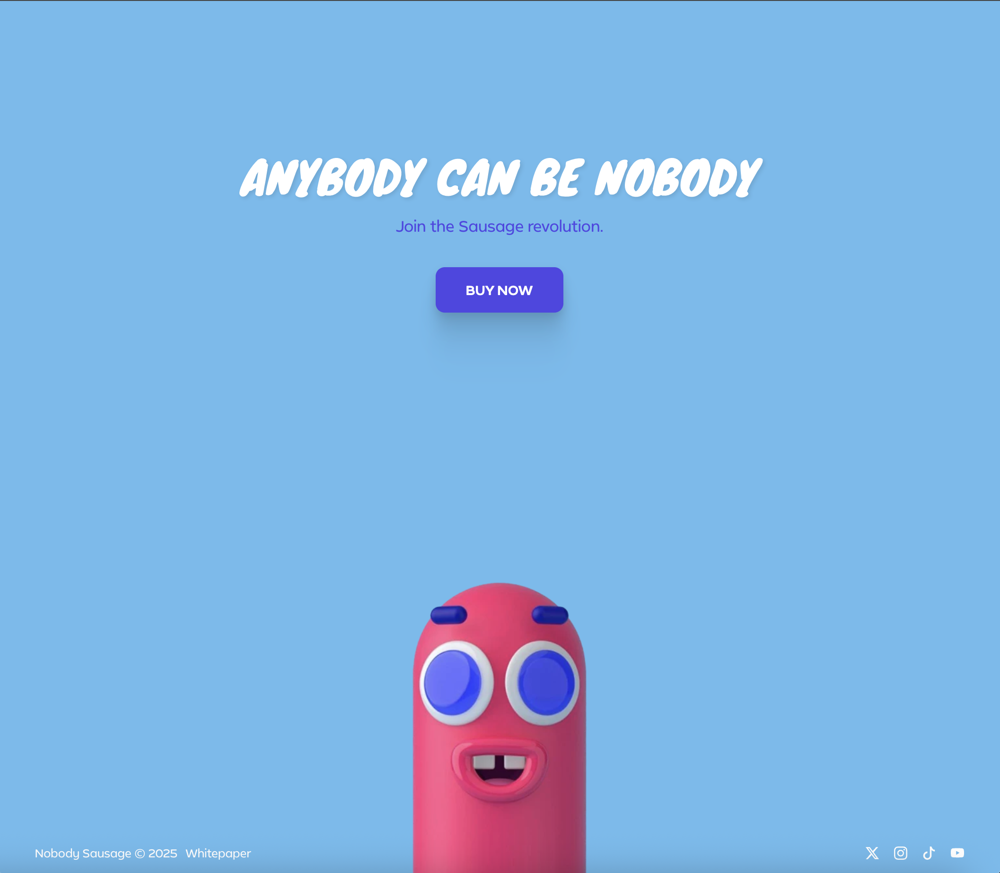
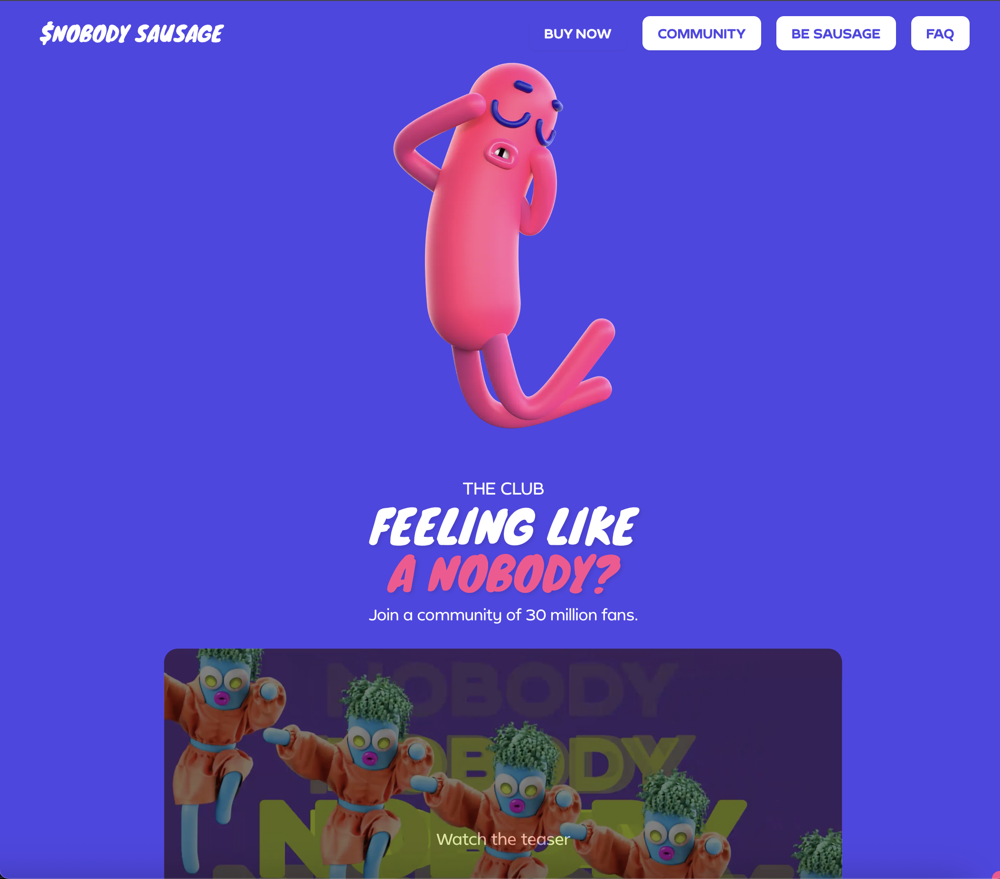
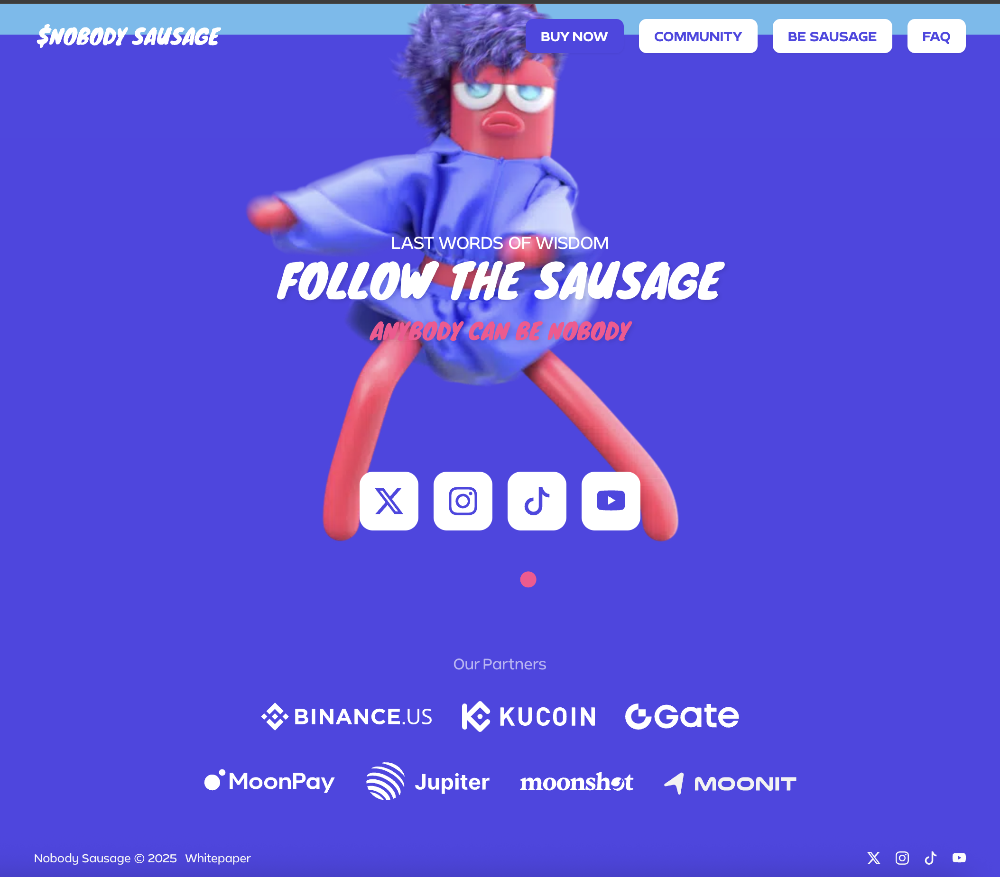

# Colorful Web Style System

A practical reference repo for designing and rebuilding **bold, colorful, high-energy websites** inspired by mascot-driven, internet-native brands.

This repo turns the color analysis into a **repeatable design system** you can use as a source of truth for future sites, landing pages, microsites, campaigns, and AI-assisted redesigns.

It is built for teams using:
- Cursor
- ChatGPT
- Claude
- v0
- Lovable
- Replit
- Figma AI tools
- image generation tools for concept art and branded scenes

---

## What this repo is for

Use this repo when you want to:
- make a site feel more alive
- add more color without making it chaotic
- create playful but structured web brands
- guide AI tools with a stable visual system
- keep design direction consistent across projects
- store screenshots and references in one place

This is **not** a copy-the-site repo.
It is a **system extraction repo**.

The goal is to borrow the principles:
- bold section-based color shifts
- high-contrast CTA structure
- strong palette discipline
- character/UI color cohesion
- playful, memorable emotional design

---

## Repo structure

```text
colorful-web-style-guide-repo/
├── README.md
├── docs/
│   ├── STYLE_GUIDE.md
│   ├── DESIGN_PRINCIPLES.md
│   ├── BUILD_WORKFLOW.md
│   ├── AI_PROMPT_LIBRARY.md
│   └── SCREENSHOT_REVIEW_TEMPLATE.md
├── prompts/
│   ├── redesign-prompt.txt
│   ├── landing-page-prompt.txt
│   ├── section-color-prompt.txt
│   └── mascot-brand-prompt.txt
├── examples/
│   └── palette-reference.json
└── reference-screenshots/
    └── .gitkeep
```

---

## Core philosophy

Most dead-looking websites have the same problem:
- too much gray
- weak CTA contrast
- one repetitive background tone
- no emotional color hierarchy
- colors that are technically safe but visually forgettable

The fix is **not** “add random colors everywhere.”

The fix is:
1. one dominant background color per section
2. one clear accent color for energy
3. one structural color for hierarchy and CTA logic
4. strong contrast between sections
5. art, UI, and typography all living in the same visual universe

---

## Quick-start rules

### 1. Use a tight palette
Base your site around:
- sky blue
- electric indigo
- hot pink
- soft white
- one or two rotating scene colors like lavender or deep blue-violet

### 2. Design section by section
Each section should feel like a **scene**, not just another box on the page.

### 3. Keep backgrounds simple
Use large flat fills or very soft gradients. Avoid muddy complexity.

### 4. Make CTAs obvious
Primary buttons should be impossible to miss.

### 5. Use color with hierarchy
Not every element deserves attention. Let a few things win.

---

## Recommended workflow

### Step 1: Save screenshots
Drop reference screenshots into `reference-screenshots/`.

### Step 2: Review them using the template
Use `docs/SCREENSHOT_REVIEW_TEMPLATE.md` to analyze:
- background system
- CTA hierarchy
- mood shifts
- palette rhythm
- visual cohesion

### Step 3: Pick a palette direction
Start from `examples/palette-reference.json` and adapt it to your brand.

### Step 4: Guide your AI
Use the prompts in `prompts/` and the system language in `docs/AI_PROMPT_LIBRARY.md`.

### Step 5: Build and refine
Use `docs/BUILD_WORKFLOW.md` to turn references into an actual site system.

---

## How to use this as the source of truth

When working with AI, point back to this repo and say:

> Follow the color system, section design logic, CTA hierarchy, and playful brand rules in this repo. Use the style guide as the source of truth.

That prevents drift and stops your site from turning into generic gradient soup.

---

## Good fit for this system

This approach works well for:
- consumer brands
- entertainment brands
- crypto projects
- creator brands
- DTC products
- meme-native internet brands
- campaign landing pages
- interactive community sites
- playful startup launches

---

## Bad fit for literal application

Do not directly force this exact style onto:
- legal products
- medtech products
- enterprise dashboards
- accounting software
- serious B2B admin tools

For those, tone it down and borrow only:
- stronger hierarchy
- cleaner section contrast
- more confident CTA color
- tighter palette discipline

---
## Reference Screenshots

### Hero Section


### Community Section


### Social Follow Section



---

## Next move

Once you add screenshots, update:
- `docs/STYLE_GUIDE.md`
- `examples/palette-reference.json`
- `docs/AI_PROMPT_LIBRARY.md`

That gives you a living repo you can reuse across every redesign.

